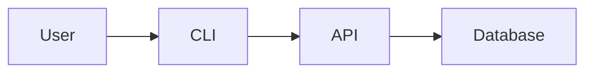

# GitHub README Creator - Reference Guide

Detailed examples, templates, and advanced guidance for creating human-focused README.md files.

## Complete README Structure Template

```markdown
# Project Name

[Clear one-sentence tagline. Example: "A fast, type-safe CLI framework for Rust developers who value developer experience."]

[Visual: Badges, screenshot, or architecture diagram]

**Quick Links**: [Documentation](link) · [Examples](link) · [API Reference](link) · [Issues](link)

---

## What Is This?

[2-3 sentence explanation in plain language. Avoid jargon. Focus on the problem solved and who benefits.]

**Key Features**:
- ✓ Feature 1 (benefit-focused, not technical)
- ✓ Feature 2
- ✓ Feature 3

## Quick Start (2 Minutes)

[Get users running as fast as possible. Assume zero prior knowledge.]

### Prerequisites

- List required tools/versions
- Link to installation guides for prerequisites

### Installation

```bash
# Copy-paste ready command
command install project-name
```

### First Usage

```bash
# Minimal working example
project-name --help
```

[Expected output screenshot or ASCII art showing success]

## Core Concepts

[Brief explanation of how the project works. 3-5 key concepts maximum.]

### Concept 1: Name

One-paragraph explanation with analogy if helpful.

### Concept 2: Name

One-paragraph explanation.

## Usage Examples

[Show, don't tell. Provide 3-5 common use cases with code.]

### Example 1: Common Task

```language
# Code example with comments
```

**Output**:
```
Expected result
```

### Example 2: Advanced Task

```language
# More complex example
```

## Documentation

- 📚 **[Full Documentation](link)** - Complete guides and tutorials
- 📖 **[API Reference](link)** - Detailed API documentation
- 🧪 **[Examples](link)** - Working code examples
- ❓ **[FAQ](link)** - Frequently asked questions

## Contributing

We welcome contributions! See our [Contributing Guide](CONTRIBUTING.md) for:
- How to set up development environment
- Where to find good first issues
- Code style and testing requirements
- Pull request process

## Community

- 💬 [Discord/Slack](link) - Chat with contributors
- 🐛 [Issue Tracker](link) - Report bugs or request features
- 📝 [Discussions](link) - Ask questions and share ideas

## License

This project is licensed under the [MIT License](LICENSE) - see the LICENSE file for details.

## Acknowledgments

- Inspired by [project/concept]
- Thanks to [contributors/organizations]
- Built with [key dependencies]
```

## Section-by-Section Guidance

### Project Name and Tagline

**DO**:
```markdown
# GitHub README Creator

Create human-focused README.md files that prioritize clarity and developer experience.
```

**DON'T**:
```markdown
# README Generator

A tool for generating README files using advanced algorithms and methodologies.
```

### Visual Elements

**Badges** (use sparingly, 3-5 maximum):
```markdown
[](link)
[](link)
[](link)
```

**Screenshots**:
```markdown

*Caption explaining what the screenshot shows*
```

**Diagrams** (Mermaid for 2026):
```markdown

```

### Quick Start

**Critical**: This section determines whether users stay or leave.

**Requirements**:
- Maximum 5 steps
- Each step has copy-paste command
- Shows expected output
- Includes troubleshooting for common issues
- Takes under 2 minutes for experienced users

**Example**:
```markdown
## Quick Start

### 1. Install

```bash
cargo install github-readme
```

### 2. Create

```bash
github-readme init my-project
```

### 3. Verify

```bash
cd my-project && cat README.md
```

Expected output:
```markdown
# My Project
[Generated README content]
```
```

### Features List

**DO** (benefit-focused):
```markdown
**Features**:
- ✓ **Fast**: Generate README in under 1 second
- ✓ **Type-Safe**: Catch errors at compile time, not runtime
- ✓ **Developer-Friendly**: Clear error messages with fix suggestions
```

**DON'T** (technical jargon):
```markdown
**Features**:
- Uses Tokio runtime for async operations
- Implements serde for serialization
- Zero-cost abstractions
```

### Usage Examples

**Structure**:
```markdown
## Usage Examples

### Basic: Generate README

```bash
github-readme generate --name my-project
```

**Output**:
```
Generated README.md with 5 sections
```

### Advanced: Custom Template

```bash
github-readme generate --template ./custom.hbs
```

**See**: [examples/](examples/) for complete working examples.
```

## Writing Style Guidelines

### Tone

- **Friendly**: Use "you" and "we"
- **Confident**: State capabilities clearly
- **Humble**: Acknowledge limitations
- **Inclusive**: Avoid assumptions about reader background

### Sentence Structure

- **Short**: 15-20 words maximum
- **Active voice**: "This tool generates" not "README is generated by this tool"
- **Parallel structure**: Keep list items grammatically consistent

### Code Examples

- **Annotated**: Add comments explaining non-obvious parts
- **Complete**: Copy-paste should work
- **Realistic**: Use realistic variable names and values
- **Tested**: Verify examples actually work

## Accessibility Checklist

Before publishing, verify:

- [ ] All images have descriptive alt text
- [ ] Headings are in logical order (H1 → H2 → H3)
- [ ] Links have descriptive text (not "click here")
- [ ] Color is not the only way information is conveyed
- [ ] Emoji are used sparingly and decoratively
- [ ] Code blocks have language specified for syntax highlighting
- [ ] Tables have header rows for screen readers
- [ ] No content in images alone (text is also in markdown)

## SEO and Discoverability

**While writing for humans, don't ignore search**:

### Keywords

- Include relevant terms naturally in headings
- Use common terminology for your domain
- Mention programming languages, frameworks, tools

### Links

- Link to related projects
- Reference official documentation
- Use descriptive anchor text

### Metadata

- Repository topics on GitHub
- Clear repository description
- Relevant tags and categories

## Multilingual READMEs

**Pattern for multiple languages**:

```markdown
[English](README.md) | [Español](README.es.md) | [Français](README.fr.md) | [日本語](README.ja.md)
```

**Best Practices**:
- Keep English as default (README.md)
- Use ISO language codes for translations
- Sync translations when updating
- Note if translations are outdated

## Common Anti-Patterns

### ❌ Wall of Text

**Bad**:
```markdown
This project is a comprehensive solution that provides developers with the ability to
create amazing things through the use of advanced algorithms and cutting-edge technology
that has been battle-tested in production environments at scale...
```

**Good**:
```markdown
This project helps developers create amazing things.

**Key capabilities**:
- Advanced algorithms for common tasks
- Battle-tested at scale
- Production-ready
```

### ❌ Assumed Knowledge

**Bad**:
```markdown
Just run `cargo build --release` and you're done.
```

**Good**:
```markdown
### Build

Requires Rust 1.70 or later ([install Rust](https://rustup.rs)):

```bash
cargo build --release
```
```

### ❌ Broken Links

**Prevention**:
- Use relative links for internal files: `[Guide](docs/guide.md)`
- Test all external links before publishing
- Consider adding link checker to CI

### ❌ Outdated Information

**Prevention**:
- Add "Last updated: YYYY-MM" badge
- Pin dependency versions in examples
- Note when screenshots may be outdated

## Quality Gate

Run this checklist before merging README changes:

```markdown
README Quality Gate:
- [ ] 5-second test: Can stranger understand purpose?
- [ ] Quick start works end-to-end (tested)
- [ ] All links functional
- [ ] All images have alt text
- [ ] Headings are hierarchical
- [ ] Code examples are tested and current
- [ ] Spelling and grammar checked
- [ ] Mobile-friendly (preview on phone)
- [ ] Dark-mode friendly (if using images)
```

## Testing Your README

### 5-Second Test

Show README to someone unfamiliar with the project for 5 seconds. Ask:
1. What does this project do?
2. Who is it for?
3. Would you use it?

### Quick Start Test

Give README to developer in target audience. Ask them to:
1. Install the project
2. Run a basic example
3. Note any confusion or errors

Track time to success and friction points.

### Mobile Preview

```bash
# Preview on mobile viewport
# Use GitHub mobile view or browser dev tools
```

Check:
- Text is readable without zooming
- Code blocks are scrollable
- Images are not too large
- Navigation is usable

## Integration with Other Skills

- **skill-creator**: Use when creating documentation skills
- **shell-script-quality**: Apply quality patterns to README scripts
- **web-search-researcher**: Research best practices and competitor READMEs
- **iterative-refinement**: Improve README through multiple passes

## Examples by Project Type

### CLI Tool

Focus on:
- Installation command
- Basic command examples
- Common flags and options
- Expected output

### Library/Framework

Focus on:
- Package installation
- "Hello World" example
- Key API patterns
- Link to API docs

### Web Application

Focus on:
- Live demo link
- Screenshot of UI
- Local development setup
- Deployment instructions

### Data Science/ML

Focus on:
- Dataset requirements
- Environment setup (conda/pip)
- Training example
- Results visualization

## Maintenance

### Keeping README Current

**Monthly**:
- Check all links
- Verify quick start still works
- Update dependency versions

**Quarterly**:
- Review for outdated information
- Add new features to key features list
- Update screenshots if UI changed

**Per Release**:
- Update version badges
- Add new features to changelog
- Note breaking changes prominently

### Version-Specific READMEs

For projects with breaking changes between versions:

```markdown
## Documentation by Version

- **v2.x** (current) - This README
- **v1.x** (legacy) - [View README](README.v1.md)
```

## Summary

Creating effective README files:

1. **Human-First**: Write for people, not bots
2. **5-Second Rule**: Clear purpose immediately
3. **Quick Start**: Get running in 2 minutes
4. **Progressive Disclosure**: Simple → complex
5. **Accessibility**: Screen reader friendly
6. **Visual**: Badges, diagrams, screenshots
7. **Examples**: Show, don't tell
8. **Links**: Point to deeper documentation
9. **Contributing**: Make it easy to help
10. **Maintain**: Keep current and accurate

A great README is the single most important factor in project adoption and contributor engagement.
