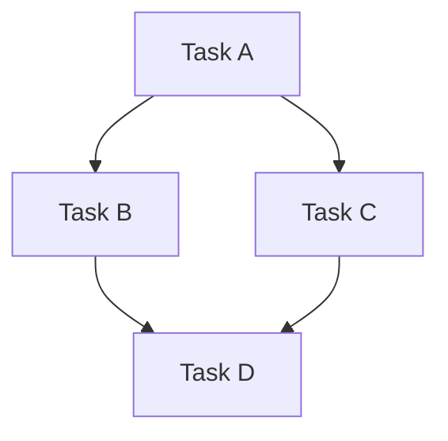

# Task Decomposition Reference Guide

Breaking complex tasks into manageable components.

## Examples

### Feature Implementation

1. Decompose into: setup, core logic, tests, docs
2. Execute in sequence with verification gates
3. Synthesize final result

### Refactoring

1. Analyze codebase patterns
2. Identify affected files
3. Create safe migration plan
4. Execute with rollback option

### Documentation

1. Identify all files needing updates
2. Draft changes in parallel
3. Review for consistency
4. Apply atomically

## Dependency Management

### Types

- **Hard** - B must complete before A starts
- **Soft** - A can start but needs B's output
- **None** - Complete independence

### Visualization

Use mermaid diagrams to show dependencies:

## Success Criteria

- Atomic: All or nothing
- Reversible: Can undo if needed
- Testable: Verification at each step

## See Also

- Main SKILL.md in parent directory
- agent-coordination/ for execution patterns
