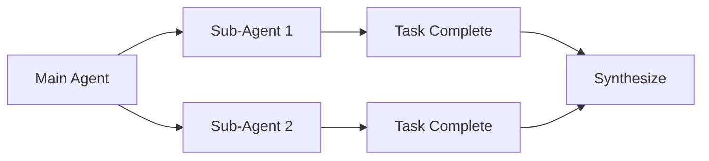

# GitHub Template AI Agents

> Production-ready template for AI agent-powered development with Claude Code, Gemini CLI, OpenCode, and more.

[](LICENSE)
[](VERSION)
[](CONTRIBUTING.md)

**Quick Links**: [Quick Start](#-quick-start) · [Documentation](#-documentation) · [Contributing](#-contributing)

---

## What Is This?

A unified harness for AI coding agents that provides consistent workflows across Claude Code, Gemini CLI, OpenCode, Windsurf, Cursor, and Copilot Chat. Built for teams who want to scale AI-assisted development with quality gates, skills, and sub-agent patterns.

**Key Features**:
- ✓ **Multi-Agent Support**: Works with 6+ AI coding tools simultaneously
- ✓ **Skills System**: Reusable knowledge modules in canonical location
- ✓ **Quality Gates**: Automatic lint, test, format before commits
- ✓ **Context Discipline**: Prevents context rot with sub-agents and hooks

## Quick Start (2 Minutes)

### Prerequisites

- One or more AI coding CLI tools ([Claude Code](https://claude.ai/code), [Gemini CLI](https://gemini.google.com), [OpenCode](https://opencode.ai))
- Git 2.30+ ([install](https://git-scm.com))

### Installation

```bash
# Use this template on GitHub, then clone
git clone https://github.com/your-org/your-project.git
cd your-project
```

### Setup

```bash
# Create skill symlinks (run once)
./scripts/setup-skills.sh

# Install git pre-commit hook
cp scripts/pre-commit-hook.sh .git/hooks/pre-commit && chmod +x .git/hooks/pre-commit
```

### Verify

```bash
./scripts/validate-skills.sh
```

Expected output:
```
✓ All skill symlinks intact
✓ SKILL.md files valid
```

## Core Concepts

### Single Source of Truth

All agents read from `AGENTS.md` - CLI-specific files (`.claude.md`, `.gemini.md`) contain only overrides.

```
AGENTS.md → Single source of truth
├── CLAUDE.md → Overrides only (@AGENTS.md)
├── GEMINI.md → Overrides only (@AGENTS.md)
└── opencode.json → Configuration
```

### Skills with Progressive Disclosure

Skills live canonically in `.agents/skills/`. Claude Code and Gemini CLI use
symlinks; OpenCode reads directly from `.agents/skills/`:

```
.agents/skills/           # Canonical source (single location)
├── task-decomposition/
├── shell-script-quality/
└── github-readme/

.claude/skills/           # Symlinks → ../../.agents/skills/
.gemini/skills/           # Symlinks → ../../.agents/skills/
```

### Sub-Agent Patterns

Delegate isolated tasks to sub-agents for context isolation:



## Usage Examples

### Basic: Run with Claude Code

```bash
claude "Implement user authentication with OAuth2"
```

### Advanced: Multi-Agent Coordination

```bash
# Main agent decomposes task, delegates to sub-agents
claude "/task-decomposition Implement the new API endpoint"
```

### Quality Gate (Automatic)

```bash
# Pre-commit hook runs automatically
git commit -m "feat: add user registration"

# Or run manually
./scripts/quality_gate.sh
```

## Documentation

- 📚 **[AGENTS.md](AGENTS.md)** - Main agent instructions (single source of truth)
- 📖 **[Quick Start](QUICKSTART.md)** - 5-minute setup guide
- 🏗️ **[Harness Overview](agents-docs/HARNESS.md)** - Architecture and patterns
- 🪝 **[Skills Guide](agents-docs/SKILLS.md)** - Creating reusable skills
- 🤖 **[Sub-Agents](agents-docs/SUB-AGENTS.md)** - Context isolation patterns
- 🔧 **[Hooks](agents-docs/HOOKS.md)** - Pre/post tool hooks
- 📊 **[Context](agents-docs/CONTEXT.md)** - Back-pressure mechanisms
- 🔄 **[Migration](MIGRATION.md)** - Adopting in existing projects

## Available Skills

| Skill | Description |
|---|---|
| [`task-decomposition`](.agents/skills/task-decomposition/) | Break complex tasks into atomic goals |
| [`shell-script-quality`](.agents/skills/shell-script-quality/) | Lint/test shell scripts (ShellCheck + BATS) |
| [`github-readme`](.agents/skills/github-readme/) | Create human-focused README.md files |
| [`parallel-execution`](.agents/skills/parallel-execution/) | Coordinate parallel agent execution |
| [`iterative-refinement`](.agents/skills/iterative-refinement/) | Progressive improvement loops |
| [`agent-coordination`](.agents/skills/agent-coordination/) | Multi-agent orchestration patterns |
| [`goap-agent`](.agents/skills/goap-agent/) | Goal-oriented action planning |
| [`web-search-researcher`](.agents/skills/web-search-researcher/) | Web research and synthesis |

## Contributing

We welcome contributions! See our [Contributing Guide](CONTRIBUTING.md) for:
- Development environment setup
- Good first issues
- Code style and testing requirements
- Pull request process

## Community

- 🐛 [Issue Tracker](https://github.com/d-o-hub/github-template-ai-agents/issues) - Report bugs
- 📝 [Discussions](https://github.com/d-o-hub/github-template-ai-agents/discussions) - Ask questions

## License

This project is licensed under the [MIT License](LICENSE) - see the LICENSE file for details.

---

**Built with AI agents. Maintained by humans.**
